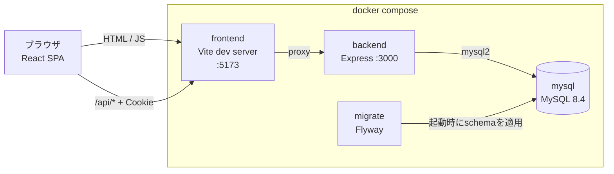
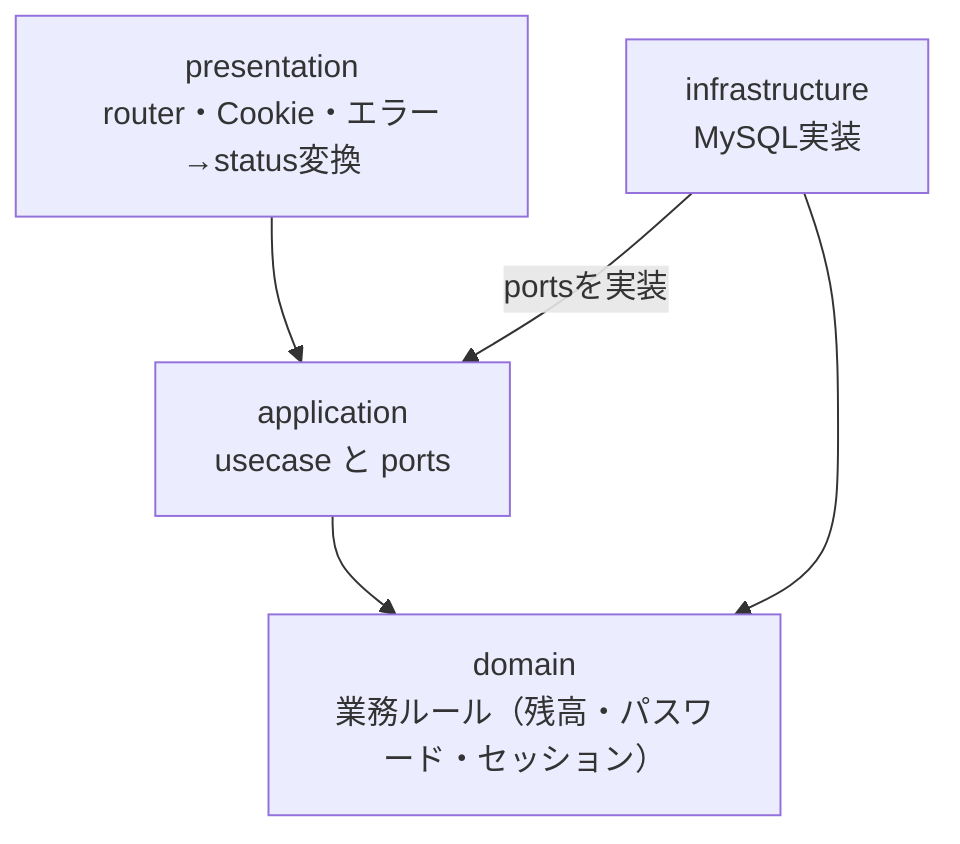
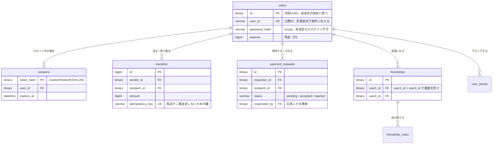
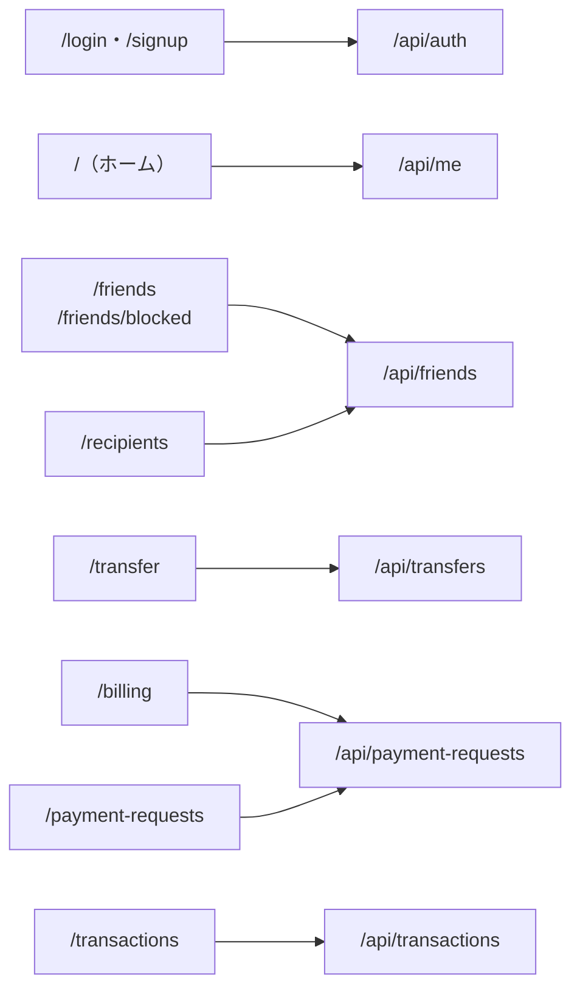
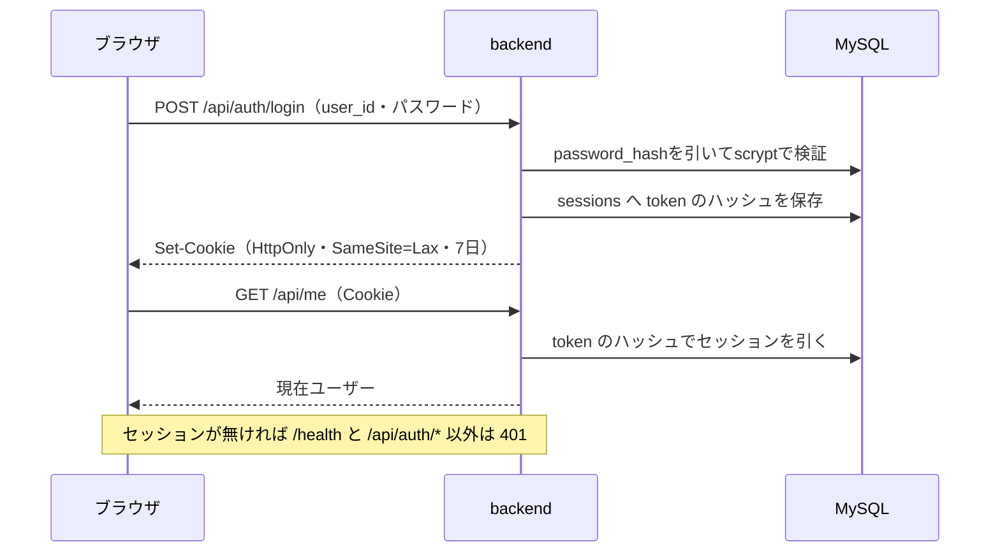
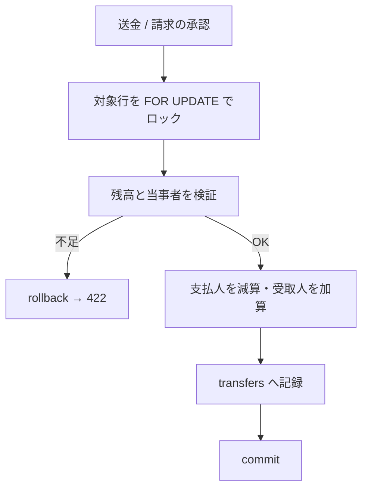

# システム構成

このドキュメントは全体像を1枚で掴むためのものです。個々のAPIの仕様は[docs/api](api)、設計判断の経緯は[docs/adr](adr)を参照してください。

## 実行構成

`docker compose`で4つのサービスが動きます。frontendとbackendは同一オリジンで、ブラウザからのAPI呼び出しはVite dev serverの`/api`プロキシがbackendへ中継します。

`migrate`はbackendより先に完了する依存にしてあり、schemaが揃う前にAPIが起動しません。

## backendのレイヤー

依存の向きは外側から内側への一方向です。`application`は`ports`（interface）ごしにDBを扱うため、MySQLを知りません。

`infrastructure`から`application`へ矢印が向くのは、実装側がinterfaceに従うためです。依存を逆転させることで、usecaseのテストがDBなしで書けます。

## データモデル

`password_hash`と`sessions`はログイン（#109〜#114）で入るもので、まだmainにはありません。

内部UUIDと公開`user_id`は別の識別子です。公開IDを送金先の指定に使わないことで、IDを知られても直接お金を動かせないようにしています。

## 画面とAPIの対応

送金・請求の相手候補は友達一覧から引くため、`/recipients`は`/api/friends`を使います。

## 認証

> ログイン（#109〜#114）はレビュー中で、まだmainへ入っていません。この節はマージ後の姿です。
> それまでは`MOCK_USER_ID`が指すユーザーを現在ユーザーとして扱います（[ADR 0004](adr/0004-use-configured-mock-user-until-login.md)）。

セッションはserver側の`sessions`テーブルで持ち、CookieにはtokenだけをHttpOnlyで渡します。DBにはtokenのハッシュしか置きません。

## お金が動く処理

送金と請求の承認は、残高更新と履歴記録を**単一のトランザクション**で行います。残高移動そのものは`applyMoneyTransfer`に集約し、送金APIと請求承認の双方から呼びます。

検証と更新の間に別の実行が割り込むと二重送金になるため、確認はトランザクションの内側で行います。送金は`Idempotency-Key`、請求の承認は同じ向きの再送を冪等にすることで、応答が届かなかったときの再送でも結果が二重にならないようにしています。
